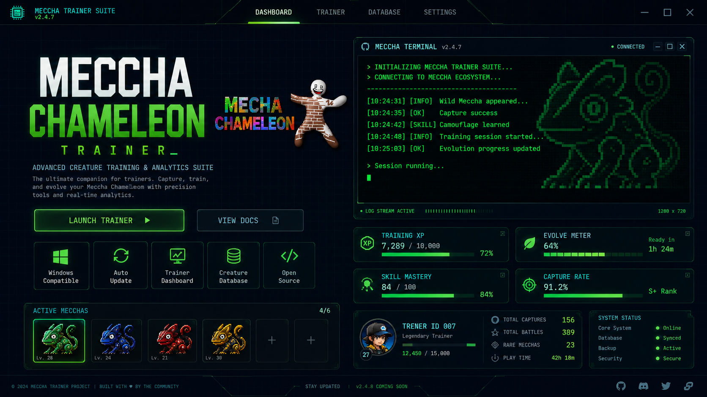

# Meccha Chameleon ESP Trainer

**Fully external box ESP for MECCHA CHAMELEON (Steam / UE5.6) – no DLL injection, no dependencies.**

---

## What is Meccha Chameleon ESP Trainer?

**Meccha Chameleon ESP Trainer** is a fully external box ESP tool for the game **MECCHA CHAMELEON** (Steam / Unreal Engine 5.6). It operates completely outside the game process — no DLL injection, no UE4SS dependency. Instead, it pattern-scans the running game and reads memory through pymem.

This tool is designed for educational and research purposes only. It helps you understand how external memory reading works in modern Unreal Engine games.

---

## Features

| Feature | Description |
|---------|-------------|
| Fully External | No injected code, no hooks — runs as a separate process |
| Pattern Scanning | Automatically finds GUObjectArray and walks the UE object array |
| Box ESP | Dynamic box ESP with distance scaling |
| Multiple Styles | Choose between corner or 2D box style |
| Snap Lines | Visual lines from your crosshair to enemy players |
| Name & Distance Labels | See player names and distances on screen |
| Toggleable Menu | Show/hide the menu with Insert or F1 key |
| Local Player Test | Separate local-player box for testing and verification |
| Transparent Overlay | Renders over the game window without interfering |

---

## Requirements

- Windows 10 / 11
- Python 3.11+
- MECCHA CHAMELEON running in windowed or borderless mode
- Dependencies: pymem, PyQt5, pywin32

Note: The tool reads memory from the game process. Game updates may break offsets and pattern signatures.

---

## Installation

2. Download the latest release or clone the repository.
3. Install Python 3.11+ if you don't have it.
4. Install the required libraries by running: pip install pymem PyQt5 pywin32
5. Launch the game (MECCHA CHAMELEON) in windowed or borderless mode.
6. Run the ESP script: python esp.py

---

## How it works

The application follows a simple pipeline:

1. Launch MECCHA CHAMELEON – Start the game in windowed or borderless mode.
2. Run the ESP – Execute python esp.py to start the tool.
3. Find game window – The script detects the game window by its title (Chameleon).
4. Pattern scan – Scans the game process memory to locate GUObjectArray and walks the Unreal Engine object array.
5. Read GameState – Reads GameState -> PlayerArray to get information about other players.
6. Render overlay – A transparent overlay appears over the game window with ESP boxes, snap lines, names, and distance labels.
7. Toggle menu – Press Insert or F1 to show or hide the configuration menu.
8. Enable local player – Enable Show Local Player to verify the projection without needing enemies.

---

## Project Structure

The source code is organised as follows:

- esp.py – Main entry point for the ESP tool.
- Overlay class – Handles the transparent overlay window and rendering.
- Pattern scanner – Pattern-scans the game process for GUObjectArray.
- Memory reader – Uses pymem to read game memory safely.
- ESP renderer – Renders dynamic box ESP with distance scaling, corner or 2D box styles, snap lines, and labels.
- Menu system – Toggleable menu (Insert / F1) for enabling/disabling features.

---

## FAQ

Q: Is this tool safe to use?
A: The tool itself is fully external and does not inject any code into the game process. However, using any third-party tool in online games may violate the game's Terms of Service and can result in account suspension or permanent ban. Use at your own risk.

Q: Does this work on the latest game version?
A: Offsets and pattern signatures are for the current UE5.6 build of MECCHA CHAMELEON. Game updates may break them. Check the repository for updates.

Q: Why aren't enemy boxes showing up?
A: Load into a match or lobby with other players for enemy boxes to appear. You can enable Show Local Player to test the projection without enemies.

Q: What if the game window title changes?
A: The script expects the window title Chameleon. If it changes, you'll need to update Overlay._find_game_window() accordingly.

Q: Do I need to run the game in a specific mode?
A: Yes – the game must be running in windowed or borderless mode for the overlay to work properly.

Q: Is there a compiled executable available?
A: Currently, the tool is provided as a Python script. You can check the Releases page for any packaged versions.

---

## Contributing

Pull requests are welcome. For major changes, please open an issue first to discuss what you'd like to change.

1. Fork the repository
2. Create a feature branch: git checkout -b feature/your-feature
3. Commit your changes
4. Open a Pull Request

---

## Disclaimer

This project is provided for educational and research purposes only. Using cheats or unauthorized third-party tools in online games may violate the game's Terms of Service and can result in account suspension or permanent ban. The authors assume no liability for any damages, bans, or other consequences resulting from the use or misuse of this software.

---

## License

Distributed under the MIT License. See LICENSE for details.

---

Made for Windows · MECCHA CHAMELEON (UE5.6) · Educational Purpose Only

